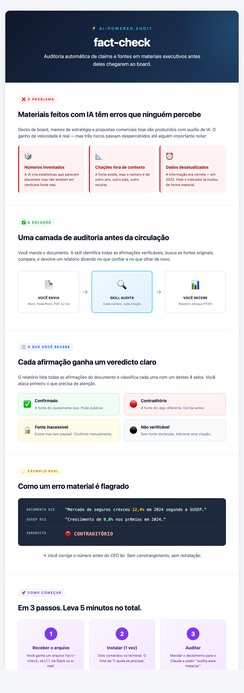

# 🔍 fact-check

> **Auditoria automática de claims e fontes em materiais executivos.**
> Decks de board, memos, propostas comerciais, relatórios — antes deles chegarem ao executivo final.

Skill compatível com [Claude Code](https://claude.com/claude-code) que recebe documentos `.docx`, `.pptx`, `.pdf` ou URLs, identifica todas as afirmações verificáveis, valida contra fontes e produz um **relatório-diagnóstico bilíngue PT/EN** classificando cada claim.



---

## ✨ O que faz

Cada afirmação do documento ganha um veredicto:

| Veredicto | Significado |
|---|---|
| ✅ **Confirmado** | A fonte declarada confirma o claim. |
| 🔴 **Contraditório** | A fonte diz algo materialmente diferente. **Erro factual.** |
| 🔒 **Fonte inacessível** | Source declarada existe mas não pôde ser lida (paywall, link quebrado). |
| ⚫ **Não verificável** | Sem fonte declarada, ou claim genérico demais. |

**O output é diagnóstico, não reescrita** — a skill diz onde olhar, você decide o que corrigir.

### 📚 Trilha completa de fontes confrontadas

Todo veredicto carrega o **link da fonte consultada + trecho citado**, e o relatório fecha com uma **bibliografia consolidada** listando cada URL acessada e quais afirmações se apoiaram nela:

```
## Fontes consultadas / Sources consulted

[1] SUSEP — Estatísticas SES, exercício 2024
    URL: https://www2.susep.gov.br/menuestatistica/SES/principal.aspx
    Citada por: c-002
    Trecho: "crescimento de 9,8% nos prêmios em 2024"

[2] CNseg — Boletim de Conjuntura, jan/2025
    URL: https://cnseg.org.br/conjuntura/boletim
    Citada por: c-002          ◀── triangulação visível
    Trecho: "setor encerrou 2024 com expansão próxima a 10%"
```

A skill também suporta **triangulação**: cada veredicto pode declarar uma fonte primária + N fontes adicionais que corroboram ou contradizem o claim. URLs aparecem clicáveis nos alertas críticos e na tabela completa (`[link] (+1)` indica fonte extra).

---

## 🚀 Instalação rápida

### Opção 1 — via plugin (recomendado)

```bash
# No Claude Code:
/plugin install github:Brunooacks/fact-check-skill
```

### Opção 2 — manual

```bash
# 1. Clonar o repo
git clone https://github.com/Brunooacks/fact-check-skill.git
cp -r fact-check-skill/skills/fact-check ~/.claude/skills/

# 2. Instalar dependências Python
pip3 install -r ~/.claude/skills/fact-check/requirements.txt

# 3. (Opcional) OCR para PDFs digitalizados
brew install tesseract poppler          # macOS
sudo apt install tesseract-ocr poppler-utils   # Linux
```

Guia visual completo em [`skills/fact-check/INSTALL.md`](skills/fact-check/INSTALL.md).

---

## 💡 Como usar

A skill **dispara automaticamente** quando você pede para verificar um documento. Não precisa de comando especial.

```
> Audita esse deck pra mim: ~/Downloads/deck-board.pptx
> Verifica os números desse memo: /caminho/memo.docx
> Check the citations in this PDF: ~/strategy.pdf
> Audita esse deck mas é CONFIDENCIAL — modo offline
```

**Output:**
- `/tmp/fact-check/report.md` — relatório bilíngue PT/EN para você ler
- `/tmp/fact-check/report.json` — formato estruturado para integração com pipelines

---

## 📐 Como funciona

```
┌─────────────────┐    ┌──────────────────┐    ┌──────────────────┐
│ 1. INGESTÃO     │ ─▶ │ 2. EXTRAÇÃO      │ ─▶ │ 3. VERIFICAÇÃO   │
│ Word/PPT/PDF/URL│    │ Numéricos +      │    │ WebSearch +      │
│ → texto + local │    │ atribuições      │    │ WebFetch         │
└─────────────────┘    └──────────────────┘    └──────────────────┘
                                                         │
                                                         ▼
                                              ┌──────────────────┐
                                              │ 4. RELATÓRIO     │
                                              │ Markdown + JSON  │
                                              │ Bilíngue PT/EN   │
                                              └──────────────────┘
```

- **Python faz o determinístico** (parsing, extração via regex, renderização).
- **Claude faz o julgamento** (quais claims valem, busca de fontes, atribuição de veredicto).

---

## 📂 Estrutura

```
fact-check-skill/
├── .claude-plugin/
│   └── plugin.json              # Metadata do plugin
├── skills/fact-check/
│   ├── SKILL.md                 # Workflow + contrato de output
│   ├── INSTALL.md               # Guia de instalação visual
│   ├── requirements.txt         # Deps Python
│   ├── config.yaml.example      # Override opcional
│   ├── scripts/                 # ingest.py, extract_claims.py, render_report.py
│   ├── references/              # Taxonomia de veredictos, hierarquia de fontes
│   └── fixtures/                # Smoke test data
├── assets/
│   ├── infografico.png          # Visual para compartilhar
│   └── infografico.html         # Versão editável
└── README.md
```

---

## 🎯 Modos de operação

- **Online (padrão):** usa `WebSearch` + `WebFetch` para verificar contra a web.
- **Offline:** detectado quando o usuário menciona "modo offline", "CONFIDENCIAL" ou marcas de confidencialidade. Verifica apenas contra URLs declaradas no próprio documento — não toca a web.

---

## ⚙️ Stack

- **Linguagem:** Python 3.9+
- **Parsing:** [python-docx](https://github.com/python-openxml/python-docx), [python-pptx](https://github.com/scanny/python-pptx), [pdfplumber](https://github.com/jsvine/pdfplumber)
- **OCR (opcional):** [pytesseract](https://github.com/madmaze/pytesseract) + [pdf2image](https://github.com/Belval/pdf2image) + Tesseract binário
- **Verificação:** ferramentas nativas do Claude Code (`WebSearch`, `WebFetch`)

---

## 📊 Métricas de qualidade (PRD)

| Métrica | Alvo |
|---|---|
| Precisão de classificação | ≥ 90% |
| Recall de extração de claims | ≥ 85% |
| **Taxa de falso "Confirmado"** | **≤ 2%** *(crítica — nunca dar segurança falsa)* |

---

## 🛣️ Roadmap

- [x] **MVP (v0.1.0):** `.docx`, `.pdf`, URL · 4 veredictos básicos · output bilíngue · modo offline
- [x] **v0.1.1:** bibliografia consolidada com URLs deduplicadas + triangulação multi-fonte por claim
- [ ] **v1:** `.pptx` · taxonomia completa (8 veredictos + 5 alertas) · hierarquia configurável de fontes · output anotado inline
- [ ] **v2:** pacote MCP portável · processamento em batch · dashboard de tendências

## 📜 Changelog

### v0.1.1 (atual)
- ✨ Nova seção **Fontes consultadas / Sources consulted** ao final do relatório — bibliografia deduplicada com IDs das afirmações que citaram cada URL.
- ✨ Suporte a **triangulação multi-fonte** via `additional_sources` em cada veredicto.
- ✨ Campo `source_title` para rótulos legíveis (ex: "SUSEP — Estatísticas SES, 2024").
- 🔒 URL passa a ser obrigatória mesmo em verdicts `not_verifiable` quando uma busca foi tentada — auditoria completa de tudo que foi confrontado.

### v0.1.0
- 🚀 Release inicial. Ingestão `.docx`/`.pdf`/URL, extração de claims numéricos e atribuídos, 4 veredictos, output bilíngue PT/EN.

---

## 🤝 Contribuindo

PRs bem-vindos. Pra mudanças não-triviais, abra uma issue antes pra discutir o escopo.

---

## 📄 Licença

MIT — veja [LICENSE](LICENSE).
